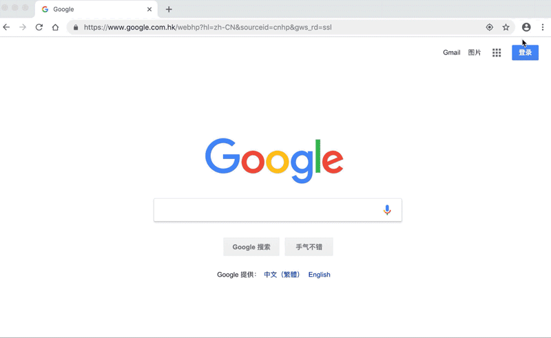

如何在谷歌浏览器添加 GoETZ扩展（插件）
======================

1. 下载 [GoETZ 插件钱包](http://etz.oss-cn-hongkong.aliyuncs.com/pehghggdpcogjpbghapgfphphfaijmbp_main.crx)

2. 检查使用的谷歌浏览器是否为最新版本

3. 打开谷歌浏览器 > 设置（新版本的浏览器点击右上角的按钮）>  更多工具  >  扩展程序

4. 把开发者选项打开

5. 将下载的 GoETZ插件钱包（.crx） 文件拖入浏览器中

6. 点击确认添加，完成安装

__________________
[GoETZ 下载连链接](http://etz.oss-cn-hongkong.aliyuncs.com/pehghggdpcogjpbghapgfphphfaijmbp_main.crx)
